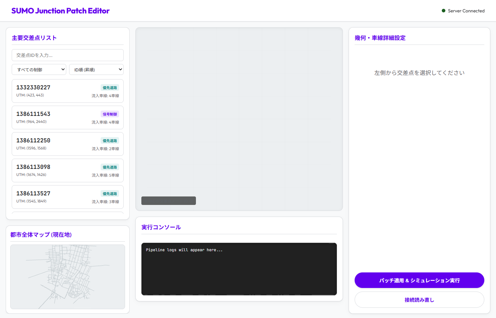
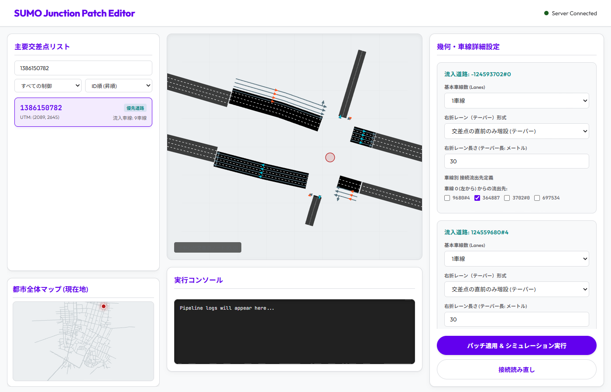

# SUMO Junction Patch Editor 操作マニュアル

本エディタを使用すると、SUMOの交差点（ジャンクション）における車線数、右折レーン（テーパー）の設定、および車線ごとの接続流出先を直感的に編集し、パッチとしてシミュレーションに適用できます。

---

## 1. 画面構成の解説

エディタは大きく分けて以下の4つのエリアで構成されています。

1. **左パネル: 主要交差点リスト & 都市全体マップ**
   - **検索・ソート**: 上部の入力欄に交差点IDを入力して絞り込むことができます。また、「信号制御」「優先道路」でのフィルターや、ID順・車線数順でのソートが可能です。
   - **都市全体マップ (現在地)**: 選択した交差点が都市全体のどこに位置しているかを赤いピンで示します。
2. **中央パネル: 交差点ビューポート (SVGキャンバス)**
   - 交差点の接続形状や車線、案内矢印がリアルタイムに可視化されます。
   - **操作**: マウスのドラッグで画面の平行移動（パン）、ホイールのスクロールでズームイン/ズームアウトが可能です。
3. **右パネル: 幾何・車線詳細設定フォーム**
   - 選択された交差点の流入道路ごとに、車線や接続先のルールを細かく編集するフォームです。
4. **下パネル: 実行コンソール**
   - パッチの適用やSUMOシミュレーション実行時のビルドログ、エラーなどがリアルタイムで表示されます。

---

## 2. 車線・接続の編集手順

### ステップ 1: 編集対象の交差点を選択する
1. 画面左側の **「主要交差点リスト」** から編集したい交差点IDをクリックします。
2. または、中央ビューポートで交差点の中心にある赤い丸（ノード）を直接クリックします。
3. 選択されると、中央ビューポートに道路の矢印レイアウトが読み込まれ、右パネルに編集フォームが表示されます。

### ステップ 2: 道路の車線・幾何パラメータを編集する
右パネルの編集フォームは、交差点に繋がる **「流入道路 (Incoming Edges)」** ごとにカード形式で分かれています。

1. **基本車線数 (Lanes)**:
   - 該当する流入道路の基本的な車線数をプルダウンから変更できます。
2. **右折レーン (テーパー) 形式**:
   - 交差点直前で車線が増える形状（テーパー）を、「なし」「交差点直前のみ増設（テーパー）」などから選択できます。
3. **右折レーン長さ (メートル)**:
   - 車線が増設される区間の長さを数値で入力します。

### ステップ 3: 車線ごとの流出先（接続先）を設定する
1. 各カードの下部にある **「車線別 接続流出先定義」** を確認します。
2. 左側通行における車線の並び順（**「車線 0」が一番左側の外側車線**）に沿って、各車線から流出できるエッジIDがチェックボックス形式で並んでいます。
3. 車を通行させたい流出先エッジIDにチェックを入れます（複数選択すると、その車線から分岐できる案内矢印が中央ビューポートに即座に反映されます）。

### ステップ 4: 変更の適用とシミュレーション実行
1. 編集が完了したら、右下にある紫色の **「パッチ適用 & シミュレーション実行」** ボタンをクリックします。
2. バックグラウンドでSUMOのネットワークビルド（`netconvert`）および交差点接続定義（`connections.con.xml` のパッチ適用）が走り、反映結果が実行コンソールに出力されます。
3. 編集内容をリセットして再読み込みしたい場合は、**「接続読み直し」** ボタンをクリックします。
